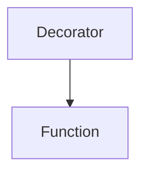

# Python Decorators

## 1. What is a Decorator?

A **decorator** in Python is like a **special wrapper** that adds new features to an existing function **without changing its actual code**.

Think of it like:

- You have a plain cake 🎂 (a function).
- You add cream and toppings 🍫🍒 (a decorator).
- The cake is still the same, but now it looks and tastes better!

---

## 2. How Decorators Work

- Functions in Python are **objects** (they can be passed around, stored in variables, returned by other functions).
- A **decorator** is just a function that **takes another function as input and returns a new function** with added functionality.

---

## 3. Syntax of a Decorator

```python
def decorator_function(original_function):
    def wrapper_function():
        print("Before the function runs")
        original_function()
        print("After the function runs")
    return wrapper_function

@decorator_function
def say_hello():
    print("Hello!")

say_hello()
```

### Output:

```
Before the function runs
Hello!
After the function runs
```

🔹 The `@decorator_function` is just a shortcut for:

```python
say_hello = decorator_function(say_hello)
```

---

## Diagram



